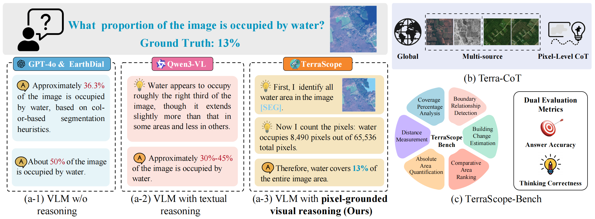
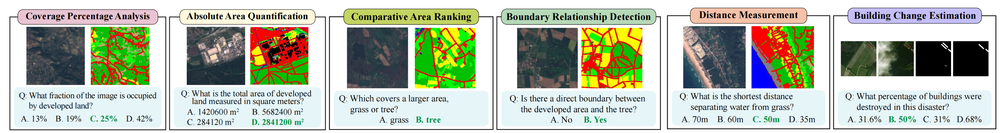

## [CVPR 2026] TerraScope: Pixel-Grounded Visual Reasoning for Earth Observation
<p align="center">
    🌐 <a href="" target="_blank">Blog</a> | 📃 <a href="" target="_blank">Paper</a> | 🤗 <a href="https://huggingface.co/sy1998/TerraScope" target="_blank">Model</a> |  🤗 <a href="https://huggingface.co/datasets/sy1998/TerraCoT" target="_blank">Training_Data</a> | 🤗 <a href="https://huggingface.co/datasets/sy1998/TerraScope-Bench" target="_blank">Benchmarks</a> |  🎥 <a href="" target="_blank">Demo</a>

</p>


#### [Yan Shu <sup>1</sup>](https://shuyansy.github.io/), [Bin Ren <sup>1,4</sup>](https://amazingren.github.io/), [Zhitong Xiong <sup>3</sup>](https://zhitong-xiong.github.io/), [Xiao Xiang Zhu <sup>3</sup>](https://scholar.google.com/citations?user=CNakdIgAAAAJ&hl=en), [Begüm Demir <sup>2</sup>](https://rsim.berlin/), [Nicu Sebe <sup>1</sup>](https://scholar.google.com/citations?user=stFCYOAAAAAJ&hl=en), and [Paolo Rota <sup>1</sup>](https://paolorota.eu/)

<sup>1</sup> University of Trento, Italy, <br>
<sup>2</sup> BIFOLD and TU Berlin, Germany, <br>
<sup>3</sup> Technical University of Munich, Germany, <br>
<sup>4</sup> MBZUAI <br>


<p align="center">
    
</p>


✨ **Highlights**:

(i) The first pixel-grounded reasoning paradigm for geospatial analysis,  enabling interpretable chain-of-thought reasoning with explicit visual grounding through segmentation masks.

(ii) Terra-CoT, a large-scale training dataset with pixel-grounded reasoning trajectories for geospatial tasks.

(iii) TerraScope-Bench, a comprehensive benchmark for evaluating pixel-grounded geospatial reasoning across diverse EO scenarios.


## Model Weights
| Model | Link |
|-------|------|
| TerraScope (8B) | [🤗 sy1998/TerraScope](https://huggingface.co/sy1998/TerraScope) |
| TerraScope-Pretrain | [🤗 sy1998/TerraScope-Pretrain](https://huggingface.co/sy1998/TerraScope-Pretrain) |


## Installation
```bash
conda create -n vlm python=3.10
conda activate vlm
conda install pytorch==2.3.1 torchvision==0.18.1 pytorch-cuda=12.1 cuda -c pytorch  -c "nvidia/label/cuda-12.1.0" -c "nvidia/label/cuda-12.1.1"
pip install mmcv==2.1.0 -f https://download.openmmlab.com/mmcv/dist/cu121/torch2.3/index.html
pip install -r requirements.txt
```

## Demo

We provide a demo script [`demo.py`](demo.py) that runs inference on TerraScope-Bench (single-image) and DisasterM3 (pre/post dual-image) examples, with segmentation mask visualization.

```bash
# Run demo (both single-image and dual-image examples)
python demo.py --model-path sy1998/TerraScope --device cuda:0
```

Demo images are included in [`demo_imgs/`](demo_imgs/). Output visualizations (with segmentation overlays and reasoning) are saved to `demo_output/`.


## Training

### Data Preparation

Download the training data from [🤗 sy1998/TerraScope-data](https://huggingface.co/datasets/sy1998/TerraScope-data)  and organize them under the `data/` folder.

Download the pretrained backbone weights into `pretrained/`.

### Run Training

We recommend using 8 A100 GPUs. The training config is at [`projects/terrascope/configs/terrascope_8b.py`](projects/terrascope/configs/terrascope_8b.py).

```bash
bash tools/dist.sh train projects/terrascope/configs/terrascope_8b.py 8
```

### Convert to HuggingFace Format

After training, convert the checkpoint to HuggingFace format for inference:

```bash
export PYTHONPATH="./:$PYTHONPATH"
python projects/terrascope/hf/convert_to_hf.py \
    projects/terrascope/configs/terrascope_8b.py \
    --pth-model work_dirs/terrascope_8b/iter_XXXXX.pth \
    --save-path your_model_path
```


## Evaluation

### TerraScope-Bench

TerraScope-Bench evaluates pixel-level geospatial reasoning across several tasks:

```bash
# Inference (reads from HuggingFace parquet, no local data needed)
python projects/terrascope/evaluation/infer_terrascope_bench.py \
    --model-path sy1998/TerraScope \
    --benchmark-parquet hf://datasets/sy1998/TerraScope-Bench/data/TerraScope_bench.parquet \
    --output-json eval_results/terrascope_bench_results.json

# Evaluate results
python projects/terrascope/evaluation/eval_terrascope_bench.py \
    --in eval_results/terrascope_bench_results.json
```

### DisasterM3 (Building Damage Counting)

DisasterM3 evaluates building damage assessment using pre/post-disaster image pairs from xBD.

```bash
# Inference
python projects/terrascope/evaluation/infer_disaster.py

# Evaluate results
python projects/terrascope/evaluation/eval_disaster.py
```

### Landsat30-AU VQA

```bash
# Inference
python projects/terrascope/evaluation/infer_landsat.py \
    --model-path sy1998/TerraScope \
    --input-csv data/landsatvqa/ground_truth_files/Landsat30-AU-VQA-test.csv \
    --image-root data/landsatvqa/VQA

# Evaluate results
python projects/terrascope/evaluation/eval_landsat.py \
    --pred-csv eval_results/landsatvqa_results_final.csv
```


## TerraScope-Bench

<p align="center">
    
</p>

✨ **Highlights**:

(i) TerraScope-Bench supports multi-sensor (optical and SAR) joint evaluation.

(ii) TerraScope evaluates the perception and reasoning ability along with the multi-level abilities of LMMs.

The data of TerraScope-Bench can be downloaded from [🤗 sy1998/TerraScope-Bench](https://huggingface.co/datasets/sy1998/TerraScope-Bench).


## Citation
If you find this repository useful, please consider giving a star :star: and citation

```

```

## Acknowledgement
- [Sa2VA](https://github.com/magic-research/Sa2VA) and [GlaMM](https://github.com/mbzuai-oryx/GlaMM): the codebase we built upon.

## License
This project utilizes certain datasets and checkpoints that are subject to their respective original licenses. Users must comply with all terms and conditions of these original licenses.
The content of this project itself is licensed under the [Apache license 2.0](./LICENSE).
